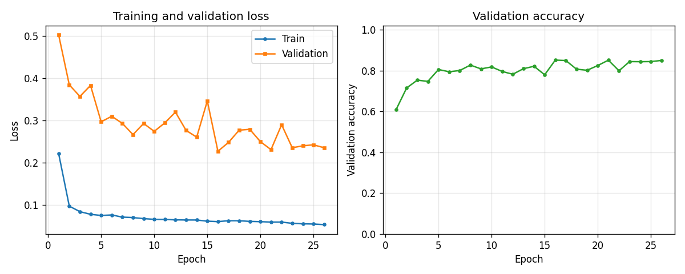
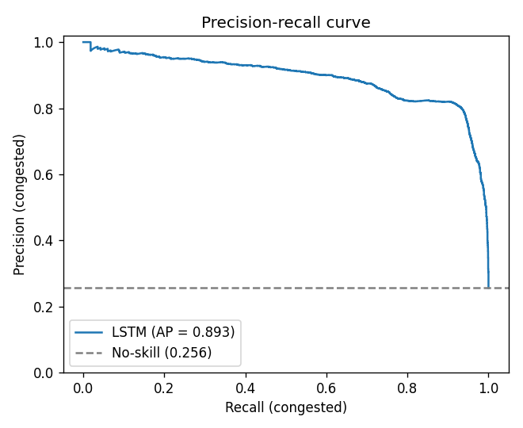
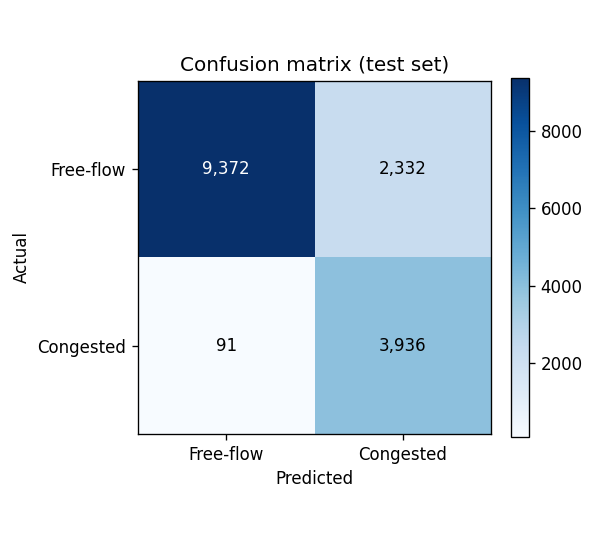
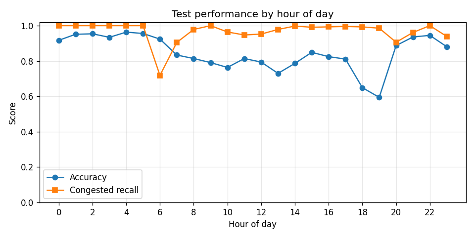

# M25 Congestion Prediction with LSTM on TfL Sensor Data

[](https://github.com/ansingh16/RL_signal_control/actions/workflows/ci.yml)

A PyTorch LSTM that forecasts traffic congestion on the M25 motorway from real
Transport for London (TfL) sensor data. Each motorway checkpoint reports traffic
volume and average speed every 15 minutes; the model reads a 4-hour window of
recent history and predicts whether the **next** interval will be congested
(average speed below 30 mph).

Congestion is the minority class — roughly 10% of intervals at a busy site, far
fewer at a quiet one — so the project is built around honest, imbalance-aware
evaluation: the LSTM is benchmarked against majority-class, rush-hour, and
speed-threshold baselines rather than reported on accuracy alone.

## Results

Trained on a single busy checkpoint (`data/raw/df_4374.parquet`, ~10% congestion)
with a chronological 70/15/15 split. Metrics are on the held-out test set of
**15,731** windows (22 features each). Full report: [`results/metrics.md`](results/metrics.md).

| Model | Accuracy | Precision | Recall | F1 |
|---|---|---|---|---|
| **LSTM (one-step forecast)** | 0.846 | 0.628 | **0.977** | **0.765** |
| Majority class | 0.744 | 0.000 | 0.000 | 0.000 |
| Rush-hour rule | 0.740 | 0.490 | 0.344 | 0.404 |
| Speed threshold\* | 0.975 | 1.000 | 0.901 | 0.948 |

LSTM average precision (PR-AUC): **0.893** vs a no-skill baseline of 0.256.

\* The speed-threshold rule predicts congestion from the *current* interval's
average speed — which is exactly what defines the label. It is a sanity check on
labelling, **not** a forecasting competitor: the LSTM and the time-based rules
only use information available *before* the predicted interval.

| Training history | Precision–recall |
|---|---|
|  |  |

| Confusion matrix | Accuracy by hour of day |
|---|---|
|  |  |

The per-hour breakdown shows where the model earns its keep: accuracy and
congested-class recall dip around the evening peak (≈17–19h), exactly the window
a fixed clock-based rule handles worst.

## Data Pipeline

```
TfL API (pytris)  ->  raw parquet (per checkpoint)  ->  feature engineering  ->  sliding windows  ->  LSTM
```

1. **Fetch** — `notebooks/data_fetch.py` pulls up to 3 years of 15-minute traffic
   reports for ~90 M25 checkpoints via the `pytris` TfL client, in parallel with
   exponential-backoff retries. Each site is saved as a parquet file in `data/raw/`.
2. **Feature engineering** — `TrafficDataProcessor` (`src/traffic_congestion/data.py`)
   turns one site's parquet into a feature frame:
   - Core signals: Total Volume, Avg mph (sensor dropouts, recorded as 0, are
     interpolated).
   - Lag features at 15 / 30 / 60 min (volume and speed).
   - Rolling mean and std over 1 h / 2 h / 4 h windows.
   - Time features: hour of day, day of week.
   - Target: `congestion = 1` when Avg mph < 30.

   That gives **22 features** per interval; the column order is frozen at build
   time so training and inference always agree.
3. **Sequence creation** — `TrafficDataset` forms sliding windows (default 16
   intervals = 4 h). Each window's label is the congestion flag of the interval
   *immediately after* it, so there is no leakage from the predicted step.
4. **Splitting** — chronological train/val/test split (default 70/15/15) by time,
   never shuffled across the boundary. A `WeightedRandomSampler` rebalances the
   training loader toward the rare congested class.

## Model

`TrafficNet` (`src/traffic_congestion/model.py`):

```
Input (seq_len x 22 features)
  -> LSTM (hidden_size=64, num_layers=2, dropout=0.2)
  -> last hidden state
  -> Linear -> ReLU -> Dropout -> Linear
  -> 2-class logits
```

Training (`ModelTrainer` in `train.py`) uses Adam with weight decay,
`ReduceLROnPlateau` scheduling, class-weighted cross-entropy for the imbalance,
and early stopping on validation loss. All hyperparameters live in typed
dataclasses in `config.py` (`DataConfig` / `ModelConfig` / `TrainConfig`).

## Project Structure

```
.
|-- src/traffic_congestion/
|   |-- data.py        # TrafficDataProcessor, TrafficDataset
|   |-- model.py       # TrafficNet (LSTM)
|   |-- train.py       # ModelTrainer (loop, scheduler, early stopping)
|   |-- evaluate.py    # metrics, baselines, plotting
|   `-- config.py      # DataConfig / ModelConfig / TrainConfig
|-- scripts/
|   `-- generate_results.py   # train one site, write results/
|-- tests/             # pytest: data pipeline, model, training loop
|-- results/           # metrics.md + evaluation plots
|-- notebooks/
|   |-- data_fetch.py             # parallel TfL data collection
|   `-- Data_exploration.ipynb    # exploratory analysis
|-- data/raw/          # parquet per checkpoint (gitignored)
|-- .github/workflows/ci.yml
|-- pyproject.toml
`-- requirements.txt
```

## How to Run

### Install

```bash
pip install -e ".[dev]"        # package + pytest/ruff
```

### Fetch data (optional — needs a TfL key)

Register at [api-portal.tfl.gov.uk](https://api-portal.tfl.gov.uk/), put your
credentials in a `.env` file, then:

```bash
python notebooks/data_fetch.py   # downloads M25 checkpoints into data/raw/
```

### Train and generate the evaluation report

```bash
PYTHONPATH=src python scripts/generate_results.py --site data/raw/df_4374.parquet
```

This trains the LSTM, evaluates on the held-out test set, and writes
`metrics.md` plus all plots to `results/`.

### Train programmatically

```python
from traffic_congestion import Config, ModelTrainer, TrafficDataProcessor, TrafficNet

cfg = Config()
proc = TrafficDataProcessor("data/raw/df_4374.parquet")
proc.prepare_site_data(speed_threshold=cfg.data.speed_threshold)

train_loader, val_loader, test_loader, info = proc.create_loaders_from_df(
    seq_len=cfg.data.seq_len, batch_size=cfg.data.batch_size, handle_imbalance=True
)

model = TrafficNet(input_size=len(info["feature_cols"]))
trainer = ModelTrainer(model)
trainer.train_model(train_loader, val_loader, epochs=cfg.train.epochs)
```

### Test

```bash
pytest
```

## Tech Stack

- **PyTorch** — LSTM model, training loop, sequence data loading
- **pandas / NumPy** — feature engineering
- **scikit-learn** — metrics (precision/recall/F1, confusion matrix, PR-AUC)
- **matplotlib** — evaluation plots
- **pytris** — TfL API client for data collection
- **pytest / ruff** — tests and linting, run in GitHub Actions CI
